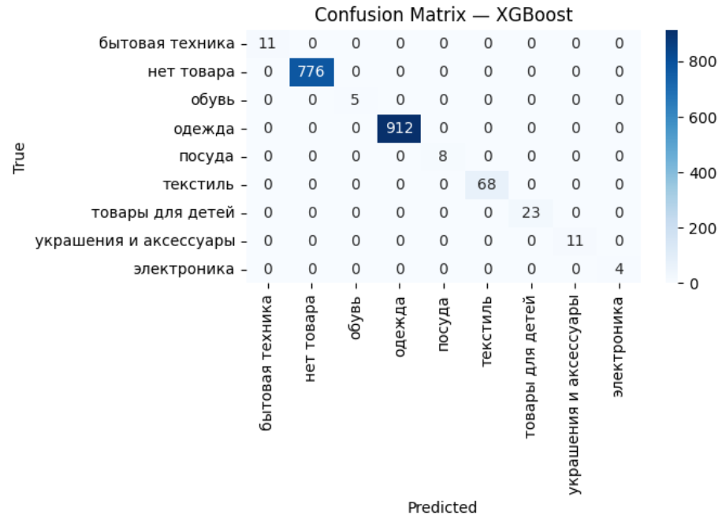

#  Классификация отзывов с маркетплейсов

## 📌 Задача
Необходимо автоматически классифицировать отзывы покупателей с маркетплейсов по категориям товаров.  
Категории включают: **бытовая техника, обувь, одежда, посуда, текстиль, товары для детей, украшения и аксессуары, электроника, нет товара**.  

Это помогает:
- ускорить аналитику отзывов
- выявлять проблемные категории  
- улучшать клиентский опыт

---

## ⚙️ Решение
Для решения задачи использована **классическая ML-пайплайн**:
1. **Очистка текста** (приведение к нижнему регистру, удаление лишних символов).  
2. **TF-IDF векторизация** (max_features = 30k, биграммы).  
3. **Truncated SVD** (300 компонент) — для снижения размерности.  
4. **XGBoost Classifier** — финальная модель.  

Базовый эксперимент начинался с **TF-IDF + SVD + LinearSVC**, но **XGBoost** показал лучшие метрики.  

---

## 📊 Результаты

### Метрики на валидации:
| Model               | Weighted F1 |
|----------------------|-------------|
| XGBoost              | **0.767**   |
| CatBoost             | 0.742       |
| Linear SVC           | 0.737       |
| Random Forest        | 0.710       |
| Logistic Regression  | 0.702       |
| Naive Bayes          | 0.672       |

### Итоговая модель (XGBoost):
- Weighted F1 (val): **0.767**  
- На тестовом наборе: модель уверенно классифицирует частые категории (например, "одежда", "нет товара"), но почти не предсказывает редкие классы.  

---

## 🔎 Confusion Matrix
Пример матрицы ошибок для XGBoost:  

---

## 🚀 Что улучшать в будущем
- Использовать **LLM (например, Qwen2.5 или GPT)** для более точной семантической классификации.  
- Применить **data augmentation** (переходы слов, переформулировки) для увеличения обучающей выборки.  

---

## 🗂️ Структура проекта
├── train_labeled.csv # размеченные данные
├── test.csv # тестовый датасет
├── cm.png # confusion matrix
├── xgb_final_model.pkl # обученная модель
├── requirements.txt # зависимости
├── baseline.ipynb # основной ноутбук
└── README.md # описание проекта
